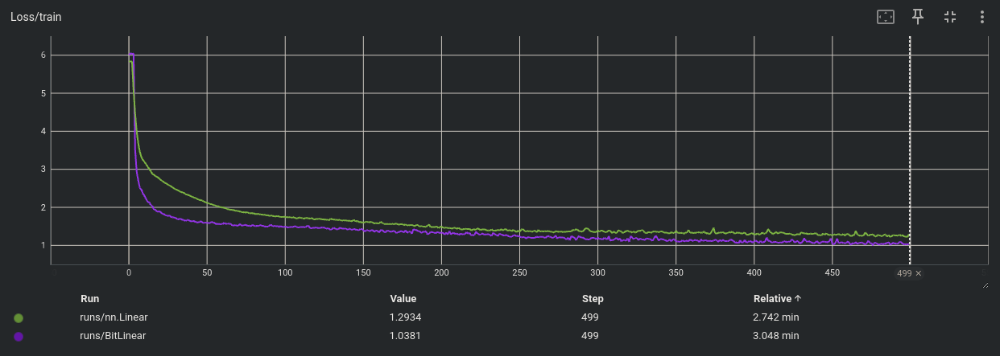

# BitLinear-Vision-Transformers
Since the paper [The Era of 1-bit LLMs](https://arxiv.org/pdf/2402.17764v1.pdf) was relased, it makes me wonder whether training transformers with
the proposed `BitLinear` can also work across all modality on applications other than LLMs, for example, vision based models such as
~~ViT~~([TerViT](https://arxiv.org/abs/2201.08050) but no source code that I can find), DETR, DINO, LlaVa etc.

## DETR (Detection Transformer)
After some attempts to modify DETR base on some of the most popular computer vision libraries such as __ultralytics__, __mmdet__, __detectron2__, it
felt like I was editing _yaml_ files most of the time which was quite frustrating. The implementation from huggingface seems more straight forward
but the code also looks very similar to [original detr repo](https://github.com/facebookresearch/detr), which was a bit out dated, e.g, it didn't
support mixed precision, it has low GPU utilization during training. Moreoever, it felt a bit too complex for an idea that is fairly straight forward.
Therefore, I decided to rewrite everything with the goal to make it easy to read, study, build and hack around.
## Notes on BitLinear
### Formulation
$y = f(x) = \tilde{W} Quant(LN(x)) = \tilde{W}\tilde{x}$
 - The tenarization of a weight $W \in \mathbb{R}^{n \times m}$ can be formulated as:

   $\tilde{W} = {RoundClip}(\dfrac{W}{\beta+\epsilon}, -1, 1)$
    
   where $RoundClip(x, a, b)=max(a, min(b, round(x)))$, and $\displaystyle \beta = \frac{1}{nm}\sum_{ij}|W_{ij}|$.

 - The activations are further quantized to $b$-bit precision by using absmax quantization, which scales activations into the range
   $[-Q_b, Q_b] (Q_b=2^b-1)$ by multiplying with $Q_b$ and dividing by the absolute maximum of the input matrix:
 
   $\tilde{x} = Quant(x) = Clip(\dfrac{xQ_b}{\gamma}, -Q_b+\epsilon, Q_b-\epsilon)$
   
   where $Clip(x, a, b)=max(a, min(b, x))$, and $\gamma = ||x||_{\infty}$

 - To perserve the variance of $y$ at 1 after quantization, $LayerNorm (LN)$ was applied to $x$ before activation quantization.

   $LN(x) = \dfrac{x-E(x)}{\sqrt{Var(x)+\epsilon}}$

### Implementation
First of all, both `x` and `w` are still in `float16` during training. However, they do get __quantized__ to maintain the property of 8 bits for `x` 
and ternary for `w`. In the code provided by 
[FAQ](https://github.com/microsoft/unilm/blob/master/bitnet/The-Era-of-1-bit-LLMs__Training_Tips_Code_FAQ.pdf),
both `x_quant` and `w_quant` are also __rescaled__ before `F.linear` which becomes

$f(x)=(\beta\tilde{W})(\dfrac{\gamma\tilde{x}}{Q_b})$

```python
x_scale = 127.0 / x.abs().max(dim=-1, keepdim=True).values.clamp(min=1e-5)
x_quant = (x * x_scale).round().clamp(-128, 127)
x_quant = x + (x_quant / x_scale - x).detach()

w_scale = 1.0 / w.abs().mean().clamp(min=1e-5)
w_quant = (w * w_scale).round().clamp(-1, 1)
w_quant = w + (w_quant / w_scale - w).detach()

output  = F.linear(x_quant, w_quant)
```
Using `.detach()` is a trick to employ straight-through estimator to make `F.linear` think it is still calculating 
$f(x)=Wx$ instead of $\tilde{W}\tilde{x}$, which can bypass the non-differentiable functions such as $RoundClip$ and $Clip$. The resulting gradient 
then becomes $\nabla f = \dfrac{\partial f}{\partial W} = x$.

According to the [FAQ](https://github.com/microsoft/unilm/blob/master/bitnet/The-Era-of-1-bit-LLMs__Training_Tips_Code_FAQ.pdf),
> the standard *F.linear* operation is replaced with a customized low-bit kernel.

> With FP8 GEMM kernels, we can use FP8 activations for training and quantize to INT8 for inference on GPU devices with CUDA comptue capability < 9.0.

but currently the exact details of those operations are not clear without the source code.

However, this operation mathmatically is equivalent to 
$f(x)=(\beta\tilde{W})(\dfrac{\gamma\tilde{x}}{Q_b})=\tilde{W}\tilde{x}(\dfrac{\beta\gamma}{Q_b})$.
which means both scaling factors can be applied to the output of `F.linear` instead of its inputs.

```python
x_scale = 127.0 / x.abs().max(dim=-1, keepdim=True).values.clamp(min=1e-5)
x_quant = (x * x_scale).round().clamp(-128, 127)
x_quant = x + (x_quant - x).detach()

w_scale = 1.0 / w.abs().mean().clamp(min=1e-5)
w_quant = (w * w_scale).round().clamp(-1, 1)
w_quant = w + (w_quant - w).detach()

output  = F.linear(x_quant, w_quant) / (x_scale * w_scale)
```
`x_quant` and `w_quant` are $[-127, 127]$ (8 bits) and $\{-1, 0, 1\}$ (tenary). 

This matrix multiplication can be done using INT8 GEMM which would be more efficient than FP8 GEMM during the forward pass according to this 
[paper](https://arxiv.org/pdf/2303.17951.pdf) from Qualcoom,
> We have also seen that implementing the FP8 formats in hardware for inference is not efficient and incurs significant overhead. Depending on the 
accumulator size, the FP8 MAC units are 50% to 180% less efficient than their INT8 counterparts.

But technicially this operation is INT8 + INT2 without needing multiplications so there is further room for improving its efficiency.

Due to floating-point arithmetic not always being associative or commutative, the outputs slightly diverge even though they are mathmatically 
equivalent. A few tests in [models/bitlinear.py](models/bitlinear.py#L60) were created to demonstrate this.

```bash
precision: torch.float16, device: cpu
rtol=1e-05, atol=1e-05 False
rtol=1e-03, atol=1e-03 True
rtol=1e-03, atol=1e-02 True
precision: torch.float16, device: cuda
rtol=1e-05, atol=1e-05 False
rtol=1e-03, atol=1e-03 False
rtol=1e-03, atol=1e-02 True
```

## Reults
### DETR


*Loss curves when running BitLinear on different conditions.*



*Comparison between using nn.Linear and BitLinear in the transformer of DETR.*

## TODO
- [x] rewrite the model to make the coder simplier, more readable, and easy to study.
    - [x] implement `MultiheadAttention` from scratch but keep `F.scaled_dot_product_attention` to utilized the optimized flash attentions kernel.
    - [x] remove the entirety of `NestedTensor` in DETR, the forward pass now takes two arguments both padded img and padding mask 
    - [x] simply SetCriterion, only `l1_loss`, `giou_loss`, and `cross_entropy` were used to compute the gradients (this is the slowest part). 
    - [x] change from post-LayerNorm to pre-LayerNorm for easy intergration with BitLinear
    - [x] training in float16 using `amp`
    - [ ] deepspeed integration for multigpu training
- [ ] perform a full COCO training run with `nn.Linear` vs `BitLinear`
- [ ] Build custom cuda kernel for `BitLinear`. According to the 
      [FAQ](https://github.com/microsoft/unilm/blob/master/bitnet/The-Era-of-1-bit-LLMs__Training_Tips_Code_FAQ.pdf),
      with FP8 GEMM kernels, we can use FP8 activations for training and quantize to INT8 for inference.
- [ ] Try `BitLinear` on DINO, LlaVa.